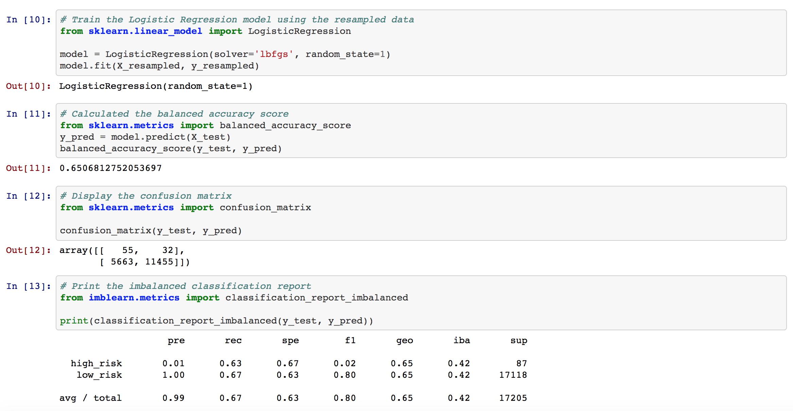
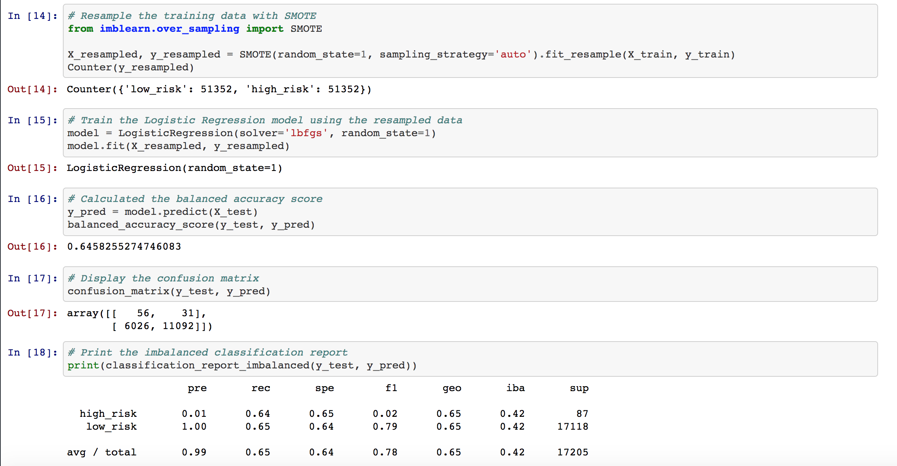
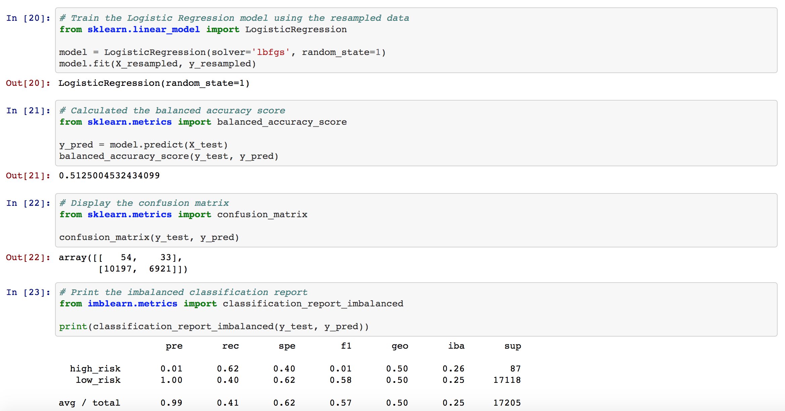
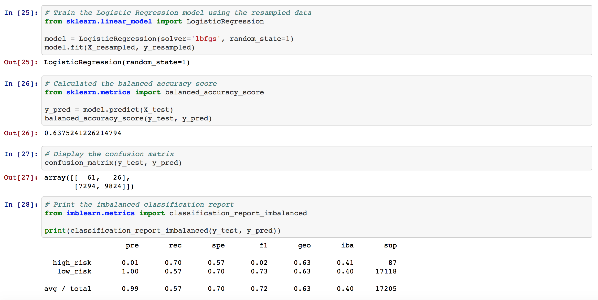
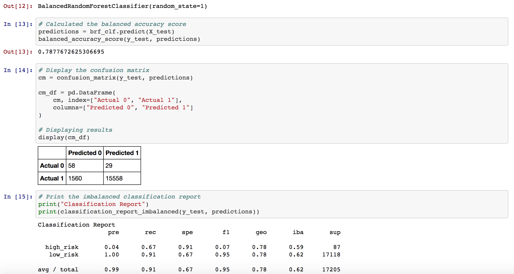
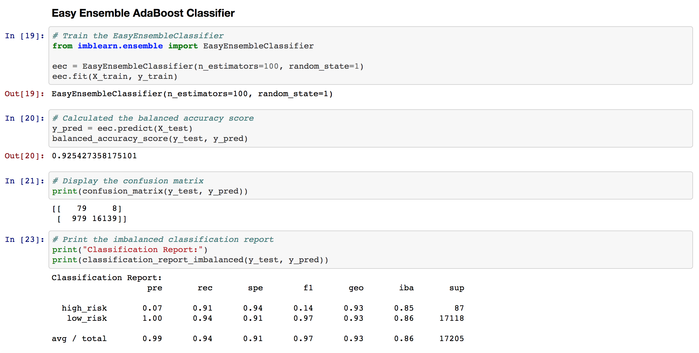

# Supervised Machine Learning and Credit Risk

## Overview of Project

The goal of this project is to predict credit risk with machine learning algorithms, compare the strengths and weaknesses of machine learning models and to assess how well a model work. 

The following task to complete:
* Use oversample the data using the RandomOverSampler and SMOTE algorithms.
* Use undersample the data using the ClusterCentroids algorithm. 
* Use a combinatorial approach of over- and undersampling using the SMOTEENN algorithm. Compare two new machine learning models that reduce bias, BalancedRandomForestClassifier and EasyEnsembleClassifier, to predict credit risk. 
* Finally, evaluate the performance of these models and make a written recommendation on whether they should be used to predict credit risk.

## Resources:
* Data sources: LoanStats_2019Q1.csv

## Tools
* Python
* scikit-learn 
* Jupyter Notebook

## Result

#### Naive Random Oversampling results:
- Balance accuracy score was 65% which is considered low.
- The precision for high_risk was 1% which is very low positivity and the recall was 63%.

#### SMOTE Oversampling results:
- Balance accuracy score was about 65% which is considered low.
- The precision for high_risk was 1% which is very low positivity and the recall was 64%.

#### Undersampling ClusterCentroids results:
- Balance accuracy score was 51% which is considered low.
- The precision for low_risk was 99% which is very high positivity and the recall was 40%.

#### Combination Sampling With SMOTEENN results:
- Balance accuracy score was 63.8% which is considered low.
- The precision for low_risk was 99%  and the recall was 57%.

#### Balanced Random Forest Classifier results:
- Balance accuracy score about 78.8%.
- The precision for low_risk was 99%  and the recall was 91%.

#### Easy Ensemble AdaBooster Classifier results:
- Balance accuracy score was 92.5% which is high.
- The precision for low_risk was 99%, again it’s high and the recall was 94%, an improvement from Balanced Random Forest.

## Summary 
The conclusion based on the results above, it appears that Easy Ensamble had the best performance model to predict credit risk because of its balanced accuracy score, high precision score and recall score. 
